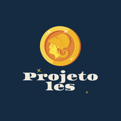

<h1 align="center">
	
</h1>

<h3 align="center">
  Projeto Les Frontend
</h3>

<p align="center">Publique ou encontre um emprego</p>

<p align="center">
   <a href="https://www.linkedin.com/in/pedrobbarbosa/">
    
  </a>

  <a href="https://www.linkedin.com/in/pedrobbarbosa/">
    
  </a>

  <a href="https://www.linkedin.com/in/pedrobbarbosa/">
    
  </a>
  
  
 
</p>

<p align="center">
  <a href="#-about-the-project">Sobre o projeto</a>&nbsp;&nbsp;&nbsp;|&nbsp;&nbsp;&nbsp;
  <a href="#-Tecnologias">Tecnologias</a>&nbsp;&nbsp;&nbsp;|&nbsp;&nbsp;&nbsp;
  <a href="#-getting-started">Começando</a>&nbsp;&nbsp;&nbsp;|&nbsp;&nbsp;&nbsp;
  <a href="#-how-to-contribute">Como contribuir</a>&nbsp;&nbsp;&nbsp;|&nbsp;&nbsp;&nbsp;
  <a href="#-license">Licença</a>
</p>

## 👨🏻‍💻 Sobre o projeto

- <p style="color: red;">Brief explanation Sobre o projeto</p>

To see the **api**, click here: [PROJECT_NAME Rest API](https://github/pedrobbarbosa/readme-template)</br>
To see the **mobile client**, click here: [PROJECT_NAME Mobile](https://github/pedrobbarbosa/readme-template)

## 🚀 Tecnologias

Tecnologias that I used to develop this web client

- [ReactJS](https://reactjs.org/)
- [TailwindCSS](https://tailwindcss.com/)
- [headlessui](https://headlessui.dev/)
- [TypeScript](https://www.typescriptlang.org/)
- [React Router DOM](https://reacttraining.com/react-router/)
- [React Icons](https://react-icons.netlify.com/#/)
- [UnForm](https://unform.dev/) [💜](https://rocketseat.com.br/)
- [Yup](https://github.com/jquense/yup)
- [Styled Components](https://styled-components.com/)
- [Polished](https://github.com/styled-components/polished)
- [Axios](https://github.com/axios/axios)
- [Husky](https://github.com/typicode/husky)
- [Commitlint](https://github.com/conventional-changelog/commitlint)
- [Commitizen](https://github.com/commitizen/cz-cli)
- [Eslint](https://eslint.org/)
- [Prettier](https://prettier.io/)
- [EditorConfig](https://editorconfig.org/)

## 💻 Começando

### Requisitos

- Have this application's [API](https://github.com/pedrobbarbosa/gobarber-api) running

**Clone o projeto e acesso o arquivo**

```bash
$ git clone https://github.com/pedrobbarbosa/NOME_DO_REPO.git && cd NOME_DO_REPO
```

**Follow the steps below**

```bash
# Install the dependencies
$ yarn

# Be sure the file 'src/services/api.ts' have the IP to your API

# Start the client
$ yarn start
```

## 🤔 Como contribuir

**Follow the steps below**

```bash
# Clone your fork
$ git clone your-fork-url && cd NOME_DO_REPO

# Create a branch with your feature
$ git checkout -b my-feature

# Make the commit with your changes
$ git commit -m 'feat: My new feature'

# Send the code to your remote branch
$ git push origin my-feature
```

After your pull request is merged, you can delete your branch

## 📝 License

This project is licensed under the MIT License - see the [LICENSE](LICENSE) file for details.

---

Made with 💜 &nbsp; &nbsp;
